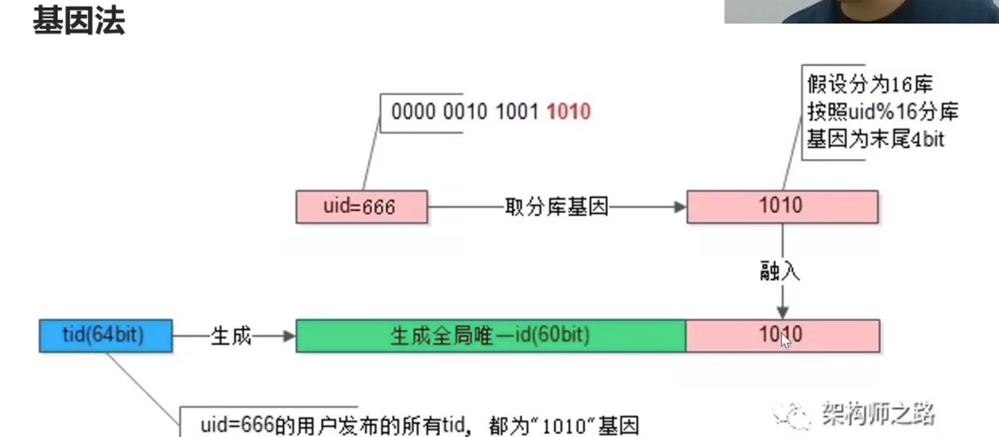

# 数据库

## 问题

### 2000 万数据表，如何平滑添加字段?

pt-online-schema-change

user(uid, name, passwd)
要扩展到
user(uid, name, passwd, age, sex)

必须有主键
如果原表有很多触发器也不行
触发器的建立触发器，应该性能，在低峰进行

### 订单拆分基因法的实施细节

用户 uid 取 md5，后 3 个 bit 与分库数量取余，来决定放到那个分库中。
下次用户登录或查询他的订单，通过相同的计算知道应该去哪个库查找。
参考 snowflake

### undo log 是怎么实现的？

