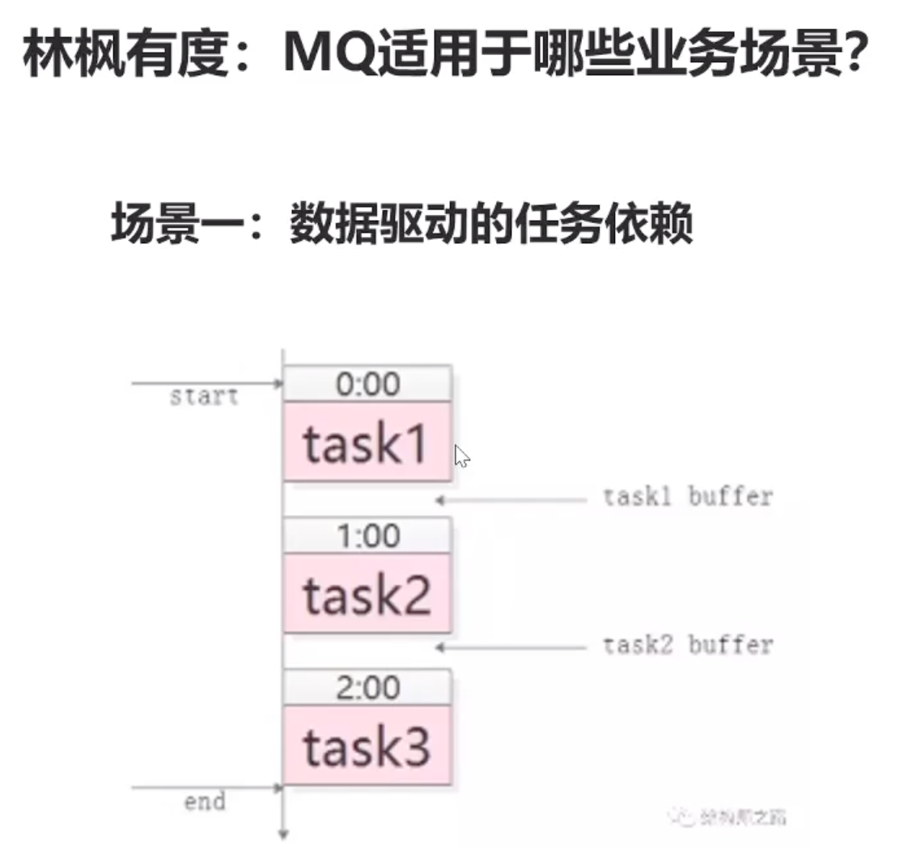
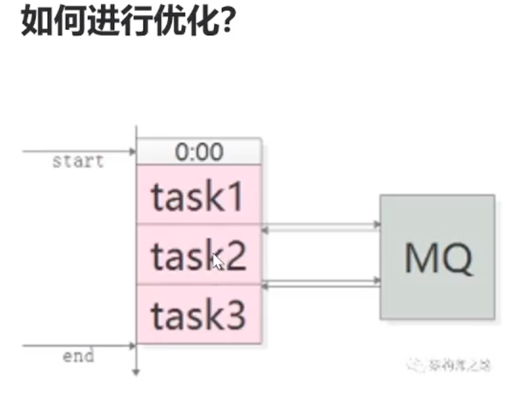
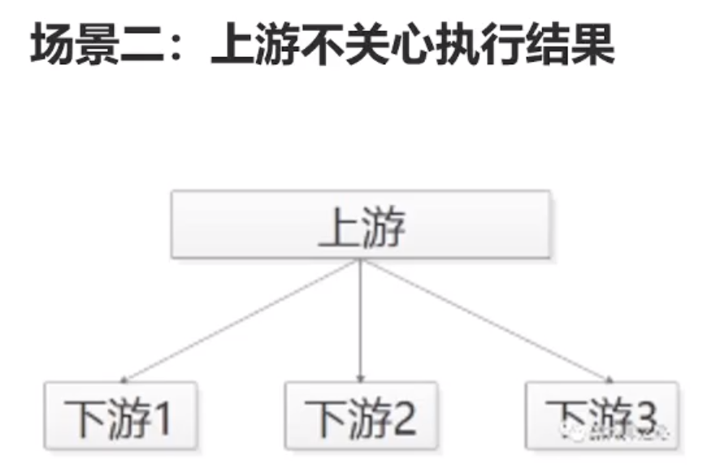
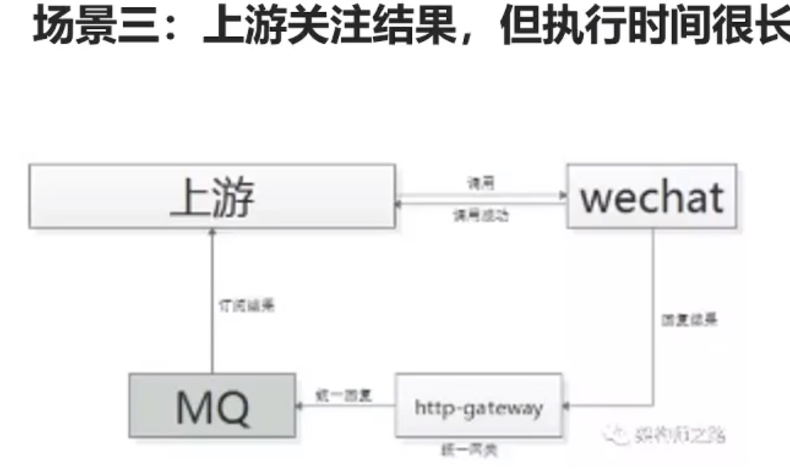
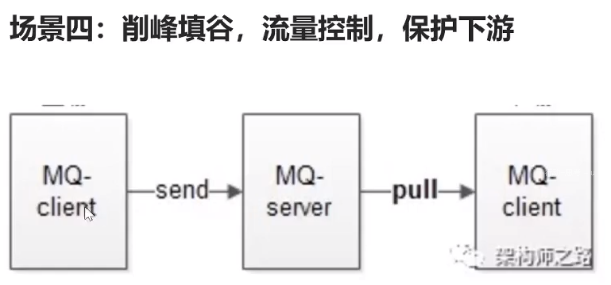

# mq

## 1. 场景

### 1.1 数据驱动的任务依赖

 

 

task1 在执行完成后，向 mq 发送完成的消息；
task2 订阅 task1 完成的消息，然后，开始执行。

好处：
1. 任务间，不需要预留 buffer
2. 当依赖多个任务，订阅多个消息就可以了

### 1.2 上游不关心结果

 

如果用 RPC，会导致耦合。上游需要知道下游（新业务需要关注发帖信息，则要修改上游的发帖模块）。

58 同城，招聘的业务，关心招聘帖子的发布，给与奖励。

好处：
- 解耦
- 上游执行效率提升，不用等下游的执行

### 1.3 上游关心结果，但执行时间很长

 

跨公网的调用，回调网关+MQ

#### 1.4 削峰填谷，流量控制，保护下游

消费方根据自己的处理能力 pull 新消息